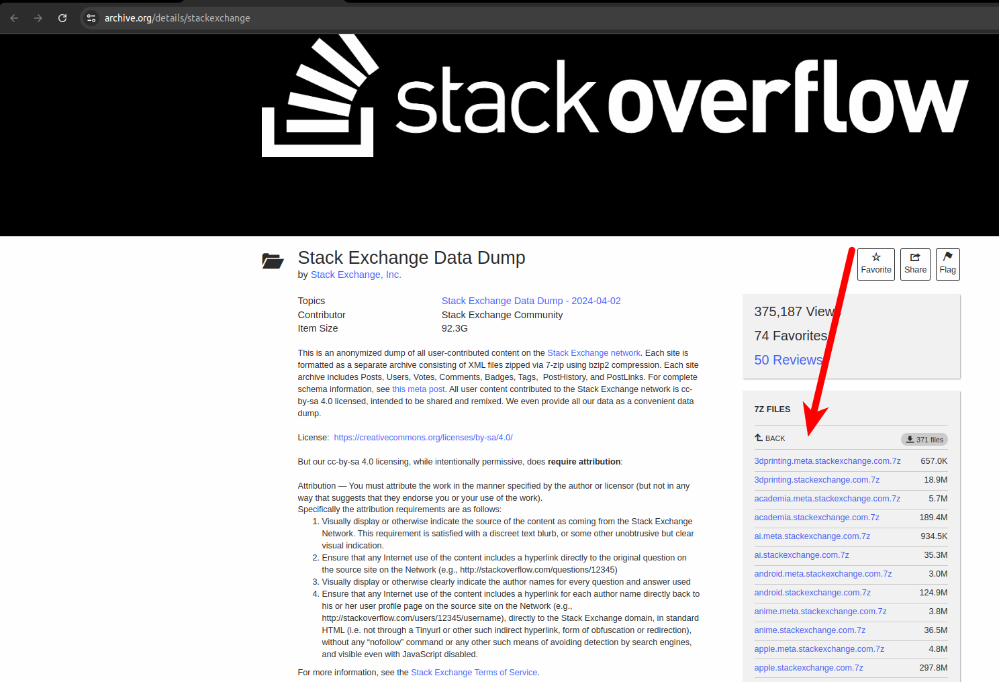
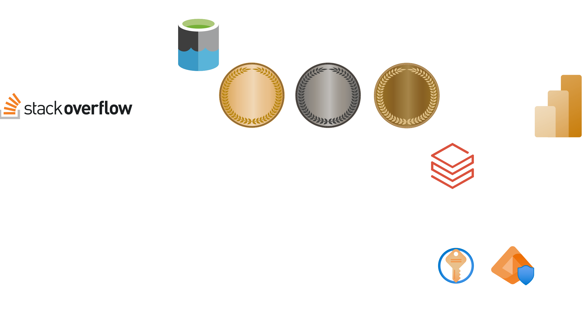
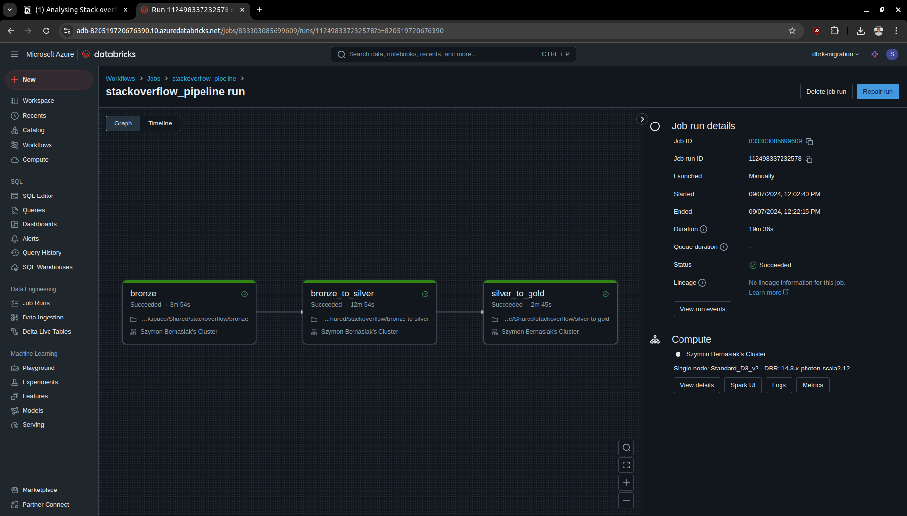
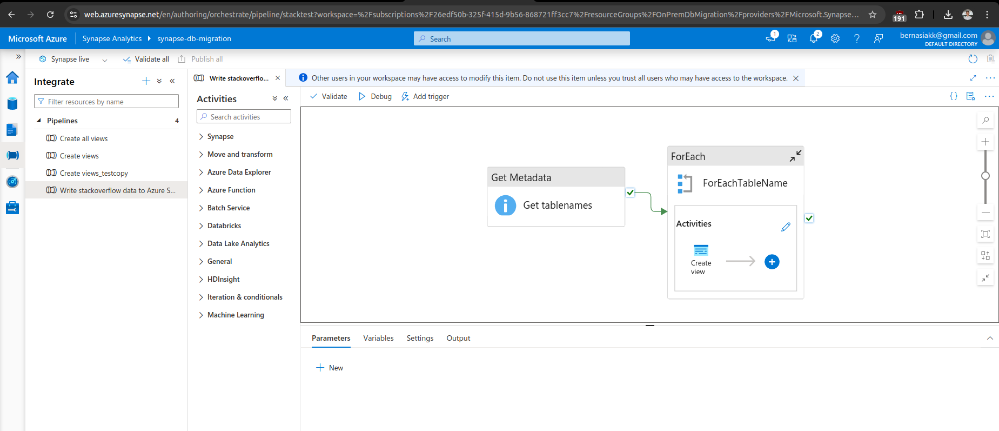
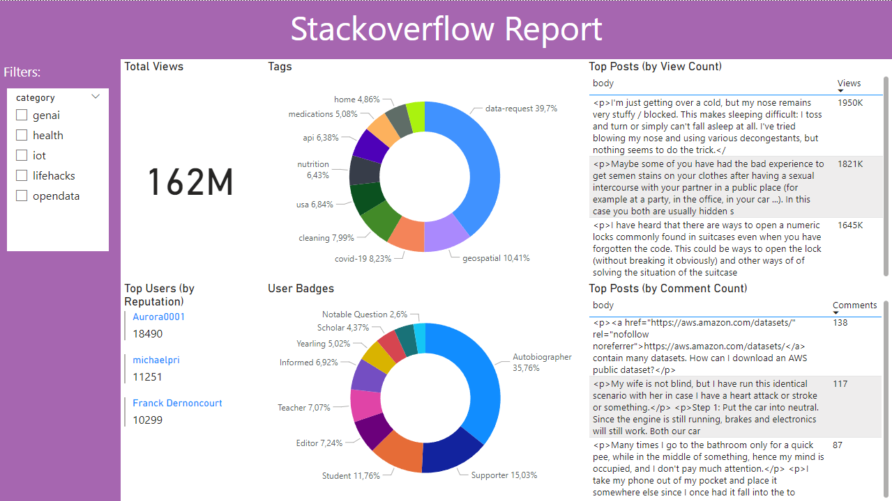

# Stackoverflow ETL Pipeline with Azure Databricks

## Project Overview

This project builds an end-to-end ETL pipeline using Azure Databricks, Synapse Analytics, and Power BI to process and analyze Stack Overflow data. Following the bronze-silver-gold lakehouse architecture, raw data is ingested, transformed, and merged into unified tables for easy querying and visualization. The pipeline is designed for scalability, allowing new data categories to be seamlessly integrated. Security and governance are managed through Azure Key Vault and RBAC.

I used [stackoverflow archive](https://archive.org/details/stackexchange) as a source for my project:

## Technologies Used

- **Storage**
  - Azure Blob Storage (bronze layer)
  - Azure Data Lake (silver and gold layer)
  - Azure Synapse SQL
- **Processing and orchestration**
  - Databricks (PySpark)
  - Synapse
- **Security & Gov**
  - Key Vault
  - EntraID
- **Visualization**
  - PowerBI

## Architecture

The architecture for this project follows the bronze-silver-gold (multi-hop) lakehouse model:
1. **Bronze Layer**: Raw data ingested into Azure Blob Storage (original xls format)
2. **Silver Layer**: The following transformations are done in this layer
   1. change column names from _CamelCase to snake_case
   2. add *category* column (genai, health, etc.)
   3. clean html columns (about_me, text, body, etc.) 
   4. limit html columns (about_me, text, body, etc.) to 255 characters (otherwise you'll have issues downloading the report to PowerBI)
3. **Gold Layer**: tables of the same kind (./genai/badges <-> ./health/badges, ./genai/comments <-> ./posts/comments, etc.) are merged and written as one. 

💡 This architecture makes the pipeline easy to scale: if you want to add new stack category - i.e., football - you only need to change it in one place within the pipeline. The rest - including Power BI - will source new data automatically.

## Pipeline Overview

### Databricks Pipeline

The pipeline consists of the following main tasks:
1. **Bronze**: Raw data ingested into Azure Blob Storage (original xls format)
2. **Bronze to Silver**: The following transformations are done in this layer
   1. change column names from _CamelCase to snake_case
   2. add *category* column (genai, health, etc.)
   3. clean html columns (about_me, text, body, etc.) and limit them to 255 characters
3. **Silver to Gold**: tables of the same kind (./genai/badges <-> ./health/badges, ./genai/comments <-> ./posts/comments, etc.) are merged and written as one. 

❗ Before running the above pipeline, make sure to run **mount storage** notebook. This notebook mounts *Azure Storage* to *Databricks tmp* folder. That makes it more efficient to work with and write data.

### Synapse Analytics Pipeline

The pipeline consists of the following main tasks:

1. **Get Metadata**: Gets name of every table (subdirectory) in *gold* container
2. **For Each**: Iterates through table names and executes a stored procedure. This procedure creates or alters Serverless SQL views for Delta tables.

## Power BI Report

💡 This pipeline makes it easy to scale the above report, here's why:
- imagine Biz needs to start analysing a new stackoverflow category (i.e., football)
- you only need to add "football" to your bronze notebook, rerun your two pipelines, refresh Power BI and the report is ready! No need to source new tables in Power BI, etc.

## Concepts Implemented

- **Multi-Hop Architecture**: Bronze-Silver-Gold layers for data processing and storage.
- **Security and Governance**: Managed through Azure Key Vault and secure access controls.

## Setup and Configuration

### Azure
Set up new resource group. Within the resource group:

**Entra ID**
1. Create New App Registration (default settings is OK)
2. Note all the IDs (you'll need them for storage mounting + when creating a synapse pipeline)
3. Create secret credentials & note the secret

**Azure Key Vault**
1. Set up a key vault
2. Add new secret for Entra ID's App registration

**Storage Accounts**
1. Make bronze storage account:
   - service type: blob
2. Make silver_gold storage account:
   - service type: data lake

Common actions for both storage accounts:
- disable soft deletes
- encryption type: CMK (customer managed key)
- Add role assignment (*Storage Blob Data Contributor*) to your Entra ID's App Registration

**Azure Databricks**
1. Create Azure Databricks (free trial is ok)
2. Create secret scope (https://your-databricks-instance.azuredatabricks.net/#secrets/createScope) & reference your key vault secret there
3. Load notebooks into Databricks & modify those marked *#TODO*
4. Create a job (bronze >> bronze to silver >> silver to gold)
  
**Azure Synapse Analytics**
1. Create Synapse Analytics

### Power BI
1. Connect to SQL database:
   - Load data -> Azure Synapse SQL
2. Create relationships (many-to-many) between category columns. (this will ensure that category filter works fine)

## Usage

1. **Run ETL Pipeline**: Trigger the pipeline in Azure Data Factory to start the data migration process.
2. **Monitor**: Use ADF monitoring tools to track the progress and troubleshoot any issues.
3. **Reporting**: Access reports and dashboards in Power BI for data analysis.

## Security and Governance

- **Data Encryption**: All data is encrypted in transit and at rest.
- **Access Controls**: Access to resources is managed using Azure Role-Based Access Control (RBAC) and Key Vault secrets.

## Contact
For any questions or inquiries, please contact me at bernasiakk@gmail.com
